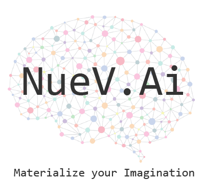
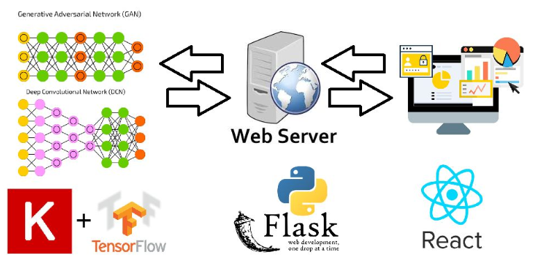
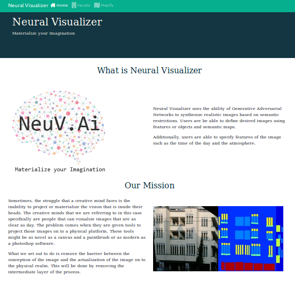
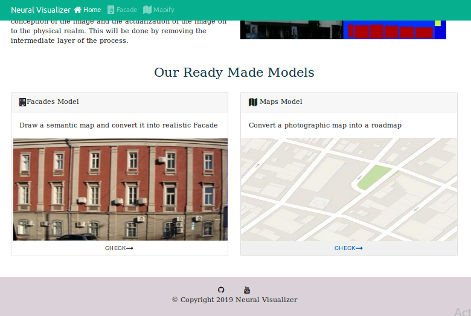
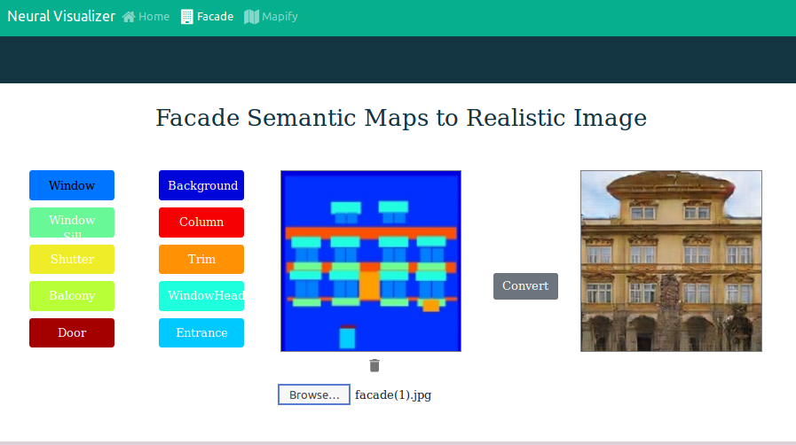
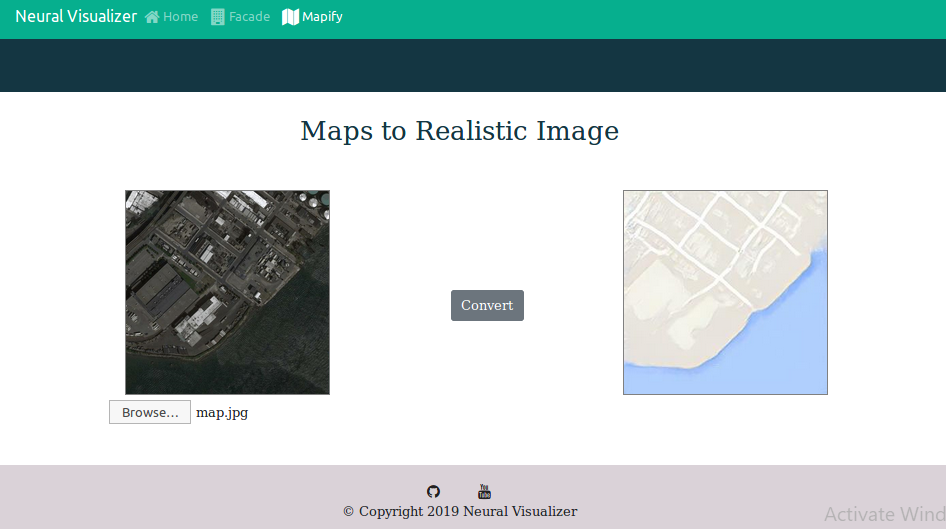

# Neural Visualizer

## Introduction
Neural Visualizer uses the ability of Generative Adversarial Networks tosynthesize realistic images based on semantic restrictions. Users are be able todefine desired images using features or objects and semantic maps. The featurescan also include environmental effects like time of day and seasonal effects.Additionally, users are able to specify features of the image in text format andthis can also be used to generate the image.The tool requires minimum amount of skill to prepare desired images in decentquality. The application itself is hosted using a Flask Web Service and isresponsive, working in real time.

## High Level Design
### Rationale
When we picked up this project, our goal was to explore the field of deep learningand develop a broad enough skill set in the field by the end of the year. In thepast few years, there has been tremendous progress in the deep learning andground breaking research has taken place. Therefore, we picked up this project tocatch up on the latest developments and understand the practical applications ofthis new technology.

Initially, we found the works of Google Deep dream very captivating and didinitial research to try and understand its internal workings. Explore Deep Dreameventually lead us to GANs which have been considered the most groundbreakingdiscovery in AI in the past 5 years. It almost seemed magical how a matrixtransformation could create human readable images from pure random noise.From there onwards, we decided to understand the workings of the algorithmand implement our own. The business case did not seem prominent but theresearch prospects were very promising. We were also sure that the businessprospects would eventually be realised. So far, this has not been achieved.

### Logical Structure
The user interacts with a web application that is written using react.js. Wheneverthe user interacts with the elements on the website, a request is generated whichis relayed to the web server. The web server running on flask is responsible forhandling requests. It appropriately responds to requests by passing the requestedparameters through one of the pretrained models. These models have beencompiled using python’s deep learning libraries; Keras and Tensorflow. Theoutcome of the model is then replied by the web server to the web client whichdisplays it to the user.

## Background
To build a generative adversarial network, first one must understand how tobuild a simple convolutional network. To understand how to build aconvolutional neural network, one must understand how to build a simple deepneural network. And so this is where we began. We deeply analyzed manyliterature content on deep learning python frameworks before we could begindesigning a model of our own. After this, we began exploring the popular modelsover the GAN zoo. Once our model selection had been completed, we prepared aWeb application using React.js and flask.

## User interface
### Home Page

### Semantic Map to Facade Converter:

### Photographic map to Roadmap converter:

## Project Video
Here is the link for [Project Video](https://www.youtube.com/watch?v=9b20yaFiPFM)

